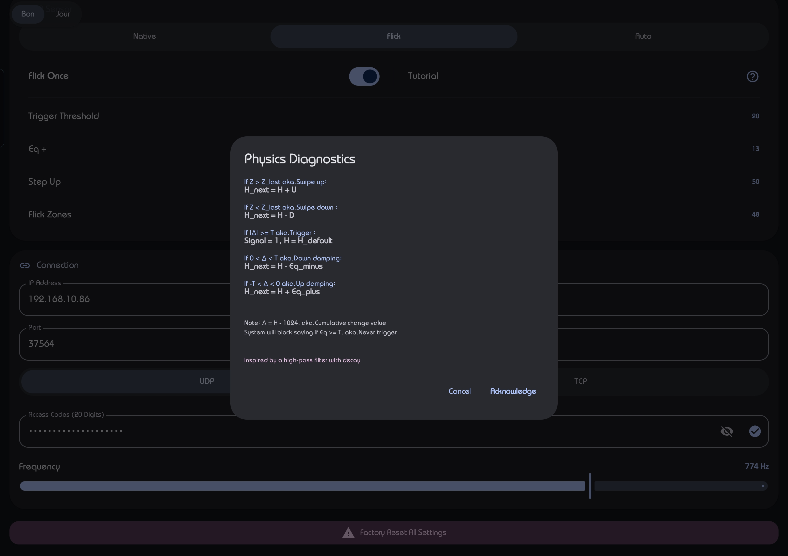
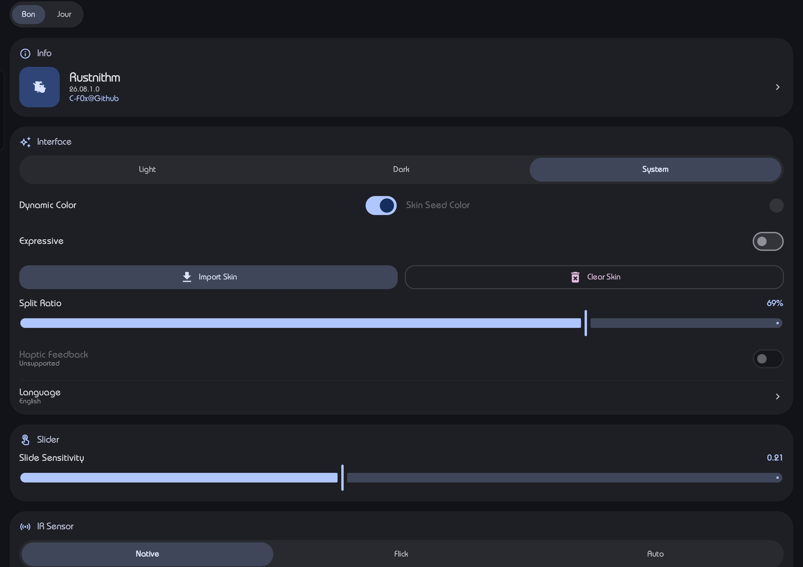
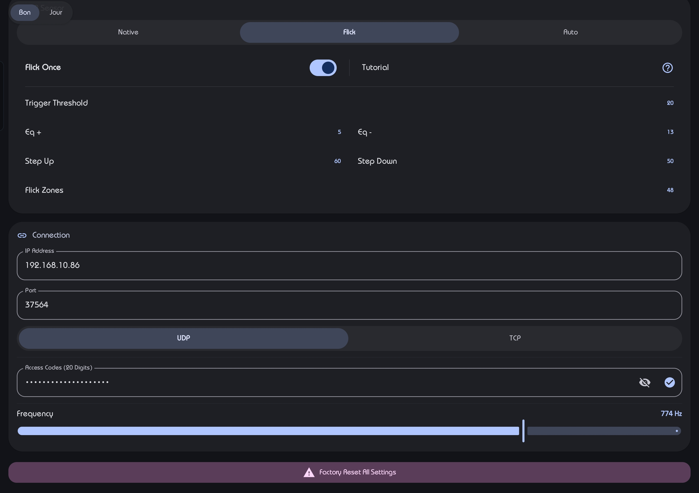
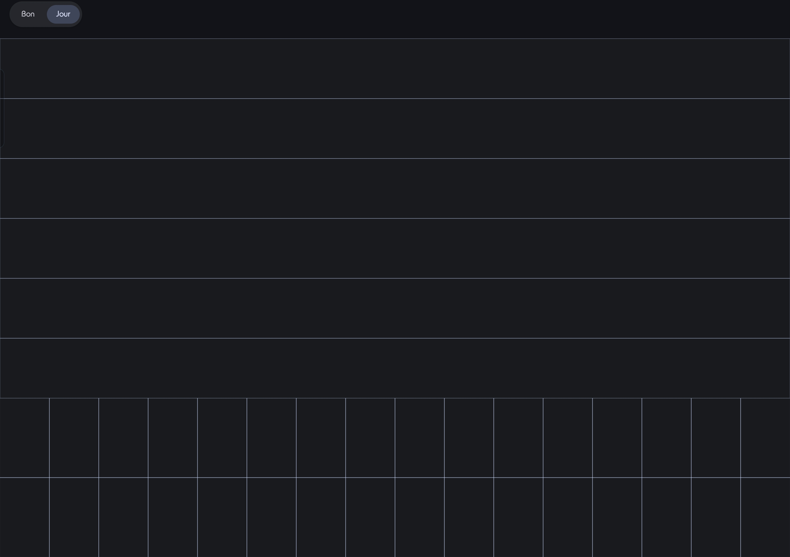
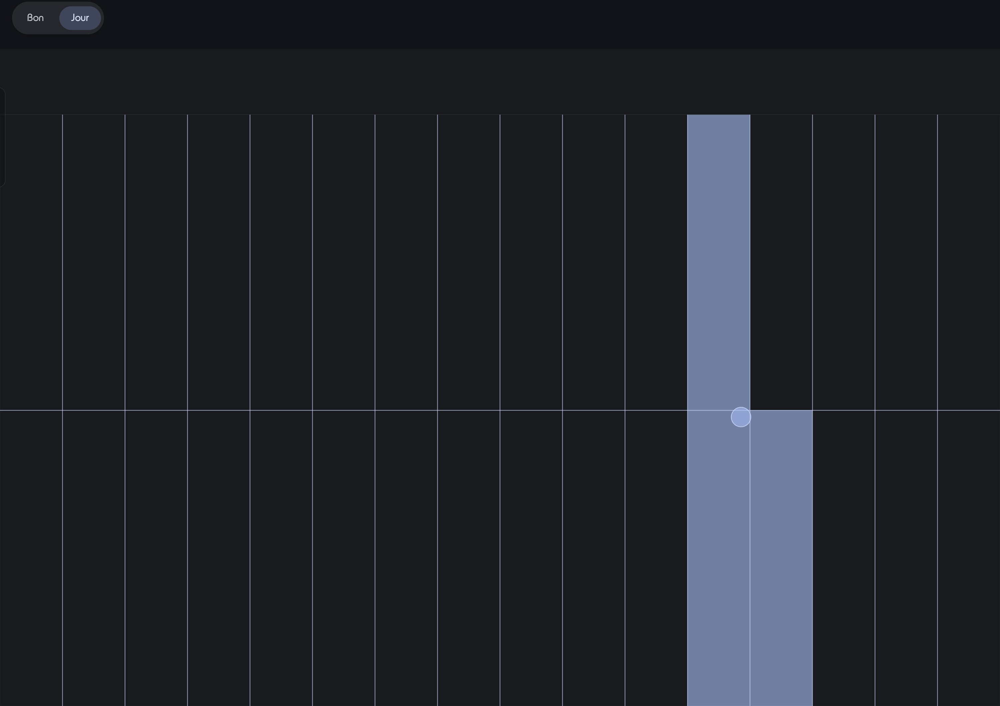

# Rustnithm-Client
Rusty Penguin

An emulator inspired from [Brokenithm](https://github.com/tindy2013/Brokenithm-Android)

# Features
## Slider
>stock experience, nothing special. 

## Air
- Native Mode
>nothing but flat, six zones are corresponding to all air zones

- Flick Mode
>pjsk-like experience. Zone 6 is permanently active, once u flick on the whole screen, there will be an pulse among zone 1-5.

- Auto Mode
>enhanced Flick Mode with automaticly pulse
## And More

# Screenshots
     
# Requirements

- Android **13+ (API 33)**, **arm64-v8a** only

## Related
[IO](https://github.com/C-F0x/Rustio)

[Server](https://github.com/C-F0x/Rustnithm-Server)

# About i18n
pr welcome

# Bug

ToggleSync doesnt work

# Todo-list

Sync with game LED

# Q&A

Q:Support ios when?

A:Wen i got macmini4 & ipadpro, lmao
might turnt to kotlin multiplatform
~~hello ipad air 120Hz and oled when~~
